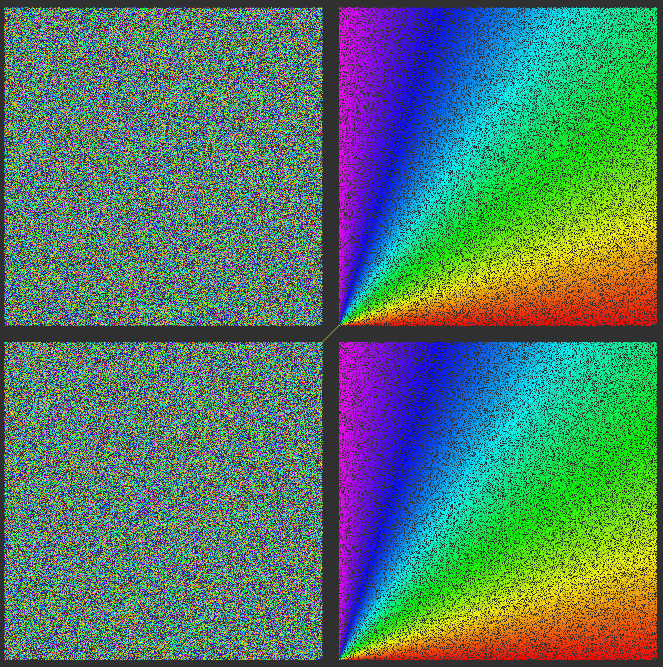
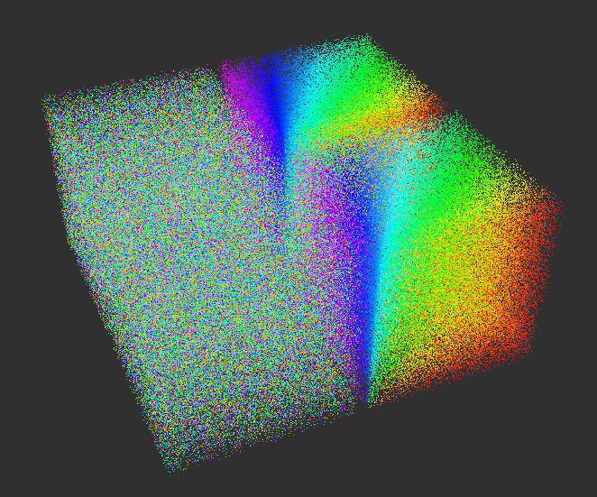

# bench_point_cloud

I've created this repository to see how re-computing of azimuth values of point clouds would affect the performance of the point cloud processing pipeline.

It's a quick and dirty way to check the performance of the pipeline.

Reference PR/Issues:
- https://github.com/autowarefoundation/autoware-documentation/pull/180#issuecomment-1315489012
- https://github.com/autowarefoundation/autoware.universe/issues/1127#issuecomment-1315500517

## Compiling & running

```sh
mkdir -p bench_point_cloud_ws/src
cd bench_point_cloud_ws/src
git clone https://github.com/xmfcx/bench_point_cloud.git
cd ..
source /opt/ros/humble/setup.bash # or your ros distro
colcon build --symlink-install --cmake-args -DCMAKE_BUILD_TYPE=RelWithDebInfo -DCMAKE_EXPORT_COMPILE_COMMANDS=1
```

## Running

```sh
cd bench_point_cloud_ws
source install/setup.bash
ros2 launch bench_point_cloud bench_point_cloud.launch.xml
```

rviz2 window:




Left point clouds are randomly generated point clouds, right point clouds are sorted by azimuth values.

Top point clouds are `PointXYZI`, bottom point clouds are `PointXYZIAD` type.

Since both point clouds are same, it is expected top and bottom to be the same.

## Results

(5900x 12c24t cpu was used for the benchmark)

This package does following:
- Generate 2 point clouds with 200 000 points each:
  - With point cloud types `PointXYZI` and `PointXYZIAD` (all fields are `float32_t`)
    - `I`: intensity
    - `A`: azimuth
    - `D`: distance
- For `CloudXYZI`:
  - Compute azimuth value
  - Set intensity value to the azimuth
  - Sort point cloud by intensity
- For `CloudXYZIAD`:
  - Set intensity value to the azimuth
  - Sort point cloud by intensity
- Measure time of each step
- Publish the point clouds and the results

The results are about:
- `CloudXYZI`:
  - compute_azimuth_and_set =~ 2957 us
  - sort_by_intensity =~ 11244 us
  - total =~ 14201 us
- `CloudXYZIAD`:
  - compute_azimuth_and_set =~ 714 us
  - sort_by_intensity =~ 11164 us
  - total =~ 11878 us

The results are not very accurate, but it shows that re-computing of azimuth values of point clouds does affect the performance of the point cloud processing pipeline.

Recalculating both of them takes about 3ms of single threaded cpu time. 

Considering every 100ms we receive a new point cloud, it is not negligible.

We should store and send the azimuth values from the driver with the point cloud.
